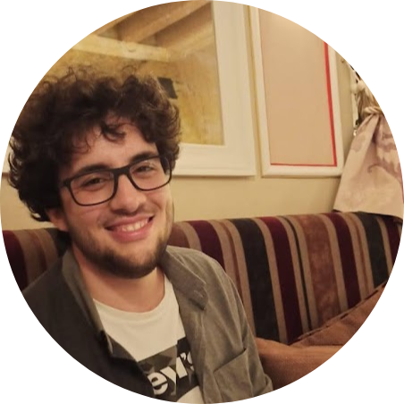

---
# the default layout is 'page'
icon: fas fa-info-circle
order: 4
---

<!-- Just for fun : 3d 3d 51 66 56 42 54 57 66 6c 6a 54 78 67 30 51 55 52 7a 56 66 56 54 53 66 74 45 4e 78 51 45 4d 4c 74 6e 62 6c 78 6d 62 6b 4a 33 55 -->

<!-- nickname : astralXploit0 -->

    

        astralXploit0 - Coach and Captain
    

    

        

            

                
            

            

                <h2 class="card-title text-dark">Prof. Davide Maiorca - Founder</h2>
                

                    Assistant Professor of Computer Engineering @ University of Cagliari, Italy
                

            

        

    

    

        Categories : Reversing, Pwn & Forensic
    

<!-- nickname : takenX10 -->

    

        takenX10- Member since: 2019
    

    

        

            

                
            

            

                <h2 class="card-title text-dark">Alessandro Frau</h2>
                

                    High School: Liceo Scientifico G. Brotzu (Quartu S.Elena)  
                    Bachelor's degree: Computer Science at UNIBO (Bologna) (Ongoing)
                

            

        

    

    

        Categories: Web, Network & a bit of Coding
    

  

<!-- nickname : pysu -->

    

        pysu - Member since: 2019
    

    

        

            

                
            

            

                <h2 class="card-title text-dark">Lorenzo Pisu</h2>
                

                    High School: Computer science at ITIS OTHOCA (Oristano)  
                    Bachelor degree: Computer science at UNICA (Cagliari)  
                    Master degree: Computer Engineering, Cybersecurity and Artificial Intelligence at UNICA (Cagliari)  
                    PhD Student in Computer Engineering at UNICA (Cagliari)  
                

            

        

    

    

        Categories: Web Exploitation
    

<!-- nickname : minn3 -->

    

        minn3- Member since: 2019
    

    

        

            

                
            

            

                <h2 class="card-title text-dark">Luca Minnei</h2>
                

                    High School: Liceo Scientifico G. Brotzu (Quartu S.Elena)  
                    Bachelor's degree: Computer Science at UNICA (Cagliari)(Ongoing)
                

            

        

    

    

        Categories: Forensics & Misc
    

<!-- nickname : k0d14k -->

    

        k0d14k - Member since: 2019
    

    

        

            

                
            

            

                <h2 class="card-title text-dark">Luca Puzzoni</h2>
                

                    High School: Computer Science for Economy at ITC Primo Levi (Pitz'e Serra)  
                    Bachelor degree: Computer science at UNICA (Cagliari)
                

            

        

    

    

        Categories: Web Exploitation, Misc & Forensic
    

<!-- nickname : vita -->

    

        vita - Member since: 2019
    

    

        

            

                
            

            

                <h2 class="card-title text-dark">Luca Vitaliano Damiano</h2>
                

                    High School: Computer Science at ITIS Michele Giua (Cagliari)  
                    Bachelor degree: Electrical, Electronic and Computer Engineering at UNICA (Cagliari) (Ongoing)
                

            

        

    

    

        Categories: Forensic and Misc
    

<!-- nickname : zoop -->

    

        zoop - Member since: 2019
    

    

        

            

                
            

            

                <h5><i class="fa-solid fa-trophy winner-text">&nbsp; UniCA CyberChallenge 2019 winner</i></h5>
                <h2 class="card-title text-dark">Matteo Cornacchia</h2>
                

                    High School: Liceo Scientifico G. Brotzu (Quartu S.Elena)  
                    Bachelor's degree: Computer Science at UNICA (Cagliari)  
                    Master's degree: Computer Science at UniPD (Padova) (Ongoing)
                

            

        

    

    

        Categories: Crypto, Reversing & Pwn
    

<!-- nickname : k0w41$k1 -->

    

        k0w41$k1- Member since: 2020
    

    

        

            

                
            

            

                <h2 class="card-title text-dark">Daniele Pintore</h2>
                

                    High School: Computer Science at ITIS Othoca (Oristano)
                

            

        

    

    

        Categories: Pwn, Reversing & some Web
    

<!-- nickname : tistaMilani -->

    

        TistaMilani- Member since: 2020
    

    

        

            

                
            

            

                <h2 class="card-title text-dark">Francesco Rocchiccioli</h2>
                

                    High School: Computer Science at ITIS Othoca (Oristano)  
                    Bachelor's degree: Computer Science at UNICA (Cagliari) (Ongoing)
                

            

        

    

    

        Categories: Web Exploitation, Network & a bit of OSINT
    

<!-- nickname : slsanna -->

    

        slsanna - Member since: 2020
    

    

        

            

                
            

            

                <h2 class="card-title text-dark">Silvia Lucia Sanna</h2>
                

                    High School: International Language High School (Spanish Option) at Istituto Margherita di Castelvì (Sassari)  
                    Bachelor degree: Electrical, Electronic and Computer Engineering at UNICA (Cagliari)  
                    Master degree: Computer Engineering, Cybersecurity and Artificial Intelligence at UNICA (Cagliari)  
                    OpenECSC 2022 top 3 in all 3 rounds  
                    National PhD in Artificial Intelligence for Security - University of Cagliari
                

            

        

    

    

        Categories: Forensic, a bit of Reverse & Web Exploitation
    

<!-- nickname : xamivel -->

    

        xamivel - Member since: 2020
    

    

        

            

                
            

            

                <h2 class="card-title text-dark">Simone Schirru</h2>
                

                    High School: Computer Science at ITIS Othoca (Oristano)  
                    Bachelor degree: Computer Science at UNICA (Cagliari) (Ongoing)
                

            

        

    

    

        Categories: Pwn, Rev & some Web Exploitation
    

<!-- nickname : tosofia -->

    

        tosofia - Member since: 2020
    

    

        

            

                
            

            

                <h2 class="card-title text-dark">Sofia Tocco</h2>
                

                    High School: Computer Science at ITIS Othoca (Oristano)  
                    Bachelor's degree: Computer Science at UNICA (Cagliari) (Ongoing)
                

            

        

    

    

        Categories: Web Exploitation, Network & a bit of OSINT
    

<!-- nickname : fbk -->

    

        fbk - Member since: 2021
    

    

        

            

                
            

            

                <h5><i class="fa-solid fa-trophy winner-text">&nbsp; UniCA CyberChallenge 2021 winner</i></h5>
                <h2 class="card-title text-dark">Fabio Marotta</h2>
                

                    High School: Liceo Scientifico Amaldi (Carbonia)  
                    Bachelor's degree: Computer Engineering at UNICA (Cagliari) (Ongoing)
                

            

        

    

    

        Categories: Crypto & Web Exploitation
    

<!-- nickname : DoctorOctopus -->

    

        DoctorOctopus - Member since: 2021
    

    

        

            

                
            

            

                <h2 class="card-title text-dark">Federico Loi</h2>
                

                    High School: ITIS Minerario (Iglesias)  
                    Bachelor's degree: Electrical, Electronic and Computer Engineering at UNICA (Cagliari)  
                    Master degree: Computer Engineering, Cybersecurity & Artificial Intelligence (Cagliari)
                

            

        

    

    

        Categories: Web Exploitation
    

<!-- nickname : philippo01 -->

    

        philippo01 - Member since: 2021
    

    

        

            

                
            

            

                <h2 class="card-title text-dark">Filippo Mereu</h2>
                

                    High School: Liceo Scientifico Euclide (Cagliari)  
                    Bachelor's degree: Computer Science at UNICA (Cagliari)(Ongoing)
                

            

        

    

    

        Categories: Crypto
    

<!-- nickname : Zaua -->

    

        Zaua- Member since: 2021
    

    

        

            

                
            

            

                <h2 class="card-title text-dark">Giovanni Manca</h2>
                

                    High School: ITIS Othoca (Oristano)  
                    Bachelor's degree: Electrical, Electronic and Computer Engineering at UNICA (Cagliari)  
                    Master degree: Computer Engineering, Cybersecurity & Artificial Intelligence (Cagliari) (Ongoing)
                

            

        

    

    

        Categories: Crypto & some Rev
    

<!-- nickname : renzoorenzi -->

    

        renzoorenzi - Member since: 2021
    

    

        

            

                
            

            

                <h2 class="card-title text-dark">Lorenzo Badas</h2>
                

                    High School: Convitto Nazionale "Vittorio Emanuele II" (Cagliari)  
                    Bachelor's degree: Computer Engineering at UNICA (Cagliari) (Ongoing)
                

            

        

    

    

        Categories: Reversing, Pwn
    

<!-- nickname : maru -->

    

        maru - Member since: 2021
    

    

        

            

                
            

            

                <h2 class="card-title text-dark">Marcello Carboni</h2>
                

                    High School: Computer Science at ITIS Othoca (Oristano)  
                    Bachelor's degree: Computer Science at UNICA (Cagliari) (Ongoing)
                

            

        

    

    

        Categories: Web Exploitation, OSINT & Misc
    

<!-- nickname : ricchi24 -->

    

        ricchi24 - Member since: 2021
    

    

        

            

                
            

            

                <h2 class="card-title text-dark">Riccardo Sulis</h2>
                

                    Bachelor degree: student of information technology at university of Cagliari
                

            

        

    

    

        Categories: Pwn
    

<!-- nickname : cvrlx -->

    

        cvrlx - Member since: 2022
    

    

        

            

                
            

            

                <h2 class="card-title text-dark">Alessandro Carlo Melis</h2>
                

                    High School: Computer Science IIS Diongi Scano  
                    Bachelor Degree: Computer Science at Unica (Ongoing)
                

            

        

    

    

        Categories: Web Exploitation & OSINT
    

<!-- nickname : brn -->

    

        brn - Member since: 2022
    

    

        

            

                
            

            

                <h2 class="card-title text-dark">Bruno Pala</h2>
                

                    Bachelor degree: Computer Engineering at UniCA (Cagliari)  
                    Master degree: Computer Engineering, Cybersecurity and Artificial Intelligence at UniCA (Cagliari)
                

            

        

    

    

        Categories: Web Exploitation
    

<!-- nickname : doliv -->

    

        doliv - Member since: 2022
    

    

        

            

                
            

            

                <h2 class="card-title text-dark">Diego Oliva</h2>
                

                    High School: Computer Science @ ITIS OTHOCA (Oristano) (ongoing)
                

            

        

    

    

        Categories: Pwn & Rev
    

<!-- nickname : DieSoi -->

    

        DieSoi - Member since: 2022
    

    

        

            

                
            

            

                <h2 class="card-title text-dark">Diego Soi</h2>
                

                    High School: Scientific High School - applied science at Luigi Einaudi school (Senorbì - SU)  
                    Bachelor degree: Electrical, Electronical and Computer Engineering at UniCA (Cagliari)  
                    Master degree: Computer Engineering, Cybersecurity and Artificial Intelligence at UniCA (Cagliari)  
                    PhD Student in Computer Engineering at UniCA (Cagliari)  
                

            

        

    

    

        Categories: Web Exploitation & a bit of Reversing
    

<!-- nickname : lollo -->

    

        lollo - Member since: 2022
    

    

        

            

                
            

            

                <h5><i class="fa-solid fa-trophy winner-text">&nbsp; UniCA CyberChallenge 2022 winner</i></h5>
                <h2 class="card-title text-dark">Lorenzo Siriu</h2>
                

                    High School: ITCG Luigi Einaudi (Muravera)  
                    Bachelor degree: Computer science at UNICA (Cagliari)
                

            

        

    

    

        Categories: Crypto
    

<!-- nickname : sanmatte -->

    

        sanmatte - Member since: 2022
    

    

        

            

                
            

            

                <h2 class="card-title text-dark">Matteo Sanna</h2>
                

                    High School: Computer Science at ITIS Othoca (Oristano)  
                    Bachelor degree: Applied Computer Science and Data Analytics at UNICA (Cagliari)
                

            

        

    

    

        Categories: Web Exploitation & OSINT
    

<!-- nickname : pc98 -->

    

        pc98 - Member since: 2022
    

    

        

            

                
            

            

                <h2 class="card-title text-dark">Pietro Crabu</h2>
                

                    High School: Computer Science at ITIS Dionigi Scano (Cagliari)  
                    Bachelor degree: Computer Science at UNICA (Cagliari) (Ongoing)
                

            

        

    

    

        Categories: Forensics, OSINT & Misc
    

<!-- nickname : SalvaCa' -->

    

        SalvaC&agrave; - Member since: 2022
    

    

        

            

                
            

            

                <h2 class="card-title text-dark">Salvatore Castello</h2>
                

                    High School: Liceo Scientifico Statale A. Pacinotti (Cagliari)  
                    Bachelor degree: Computer Science at UNICA (Cagliari) (Ongoing)
                

            

        

    

    

        Categories: OSINT, Misc & Forensic
    

<!-- nickname : d1dpvl -->

    

        d1dpvl - Member since: 2022
    

    

        

            

                
            

            

                <h2 class="card-title text-dark">Simone Cocco</h2>
                

                    High school: ITIS G. Marconi Cagliari  
                    Bachelor degree: Informatica Applicata & Data Analytics at UNICA
                

            

        

    

    

        Categories: Web Exploitation & Hardware
    

